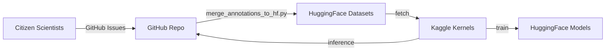

# SolarHub — ML Flow

> Support Aurora: [GitHub Sponsors](https://github.com/sponsors/soumyadipkarforma) · [Buy Me a Coffee](https://buymeacoffee.com/soumyadipkarforma)

## Core Strategy

SolarHub employs a hybrid ML architecture. Community-labeled data from **GitHub** is continuously pushed to **HuggingFace**, which serves as the data lake for **Kaggle**-based model training and inference.

## The Data Life Cycle

## 1. Data Collection & Labeling
1. **Raw SDO Imagery**: Daily image URLs are crawled from JSOC by `pull_new_urls.py`.
2. **Community Labeling**: Users submit labels and coordinates via GitHub Issues using the predefined template.
3. **Processing**: `parse_issue_annotation.py` validates and writes these labels into local JSON files in `annotations/`.

## 2. Dataset Management (HuggingFace)
HuggingFace acts as the permanent storage for all solar data.
- **Repository**: `SpaceGen/solarhub-{task_type}` (e.g., `solarhub-sunspot`).
- **Synchronization**: `merge_annotations_to_hf.py` handles schema reconciliation. It uses a non-destructive "union merge" strategy to ensure that even if the metadata schema changes over time, old labels are never lost.

## 3. Model Training (Kaggle)
*Note: Training kernels live outside this repository.*
1. **Trigger**: Training is manually triggered or scheduled on Kaggle via the Kaggle API.
2. **Execution**:
   - Downloads the latest dataset from HuggingFace.
   - Performs data augmentation on solar images (rotation, scaling, noise).
   - Trains deep learning models (e.g., Vision Transformers or CNNs) to detect solar features.
3. **Storage**: The resulting model weights are pushed to the HuggingFace Model Hub (`SpaceGen/solarhub-model-{task_type}`).

## 4. Daily Inference (Kaggle)
1. **Execution**:
   - Loads the latest model from HuggingFace.
   - Predicts labels for the new image URLs fetched in the last 24 hours.
2. **Feedback Loop**: Predictions are pushed back to the GitHub repository to be displayed to users in the frontend.

## 5. Model Evaluation
The `scripts/compute_points.py` script compares user-submitted labels against model predictions to compute real-time accuracy metrics, allowing us to track model performance improvements as the dataset grows.
