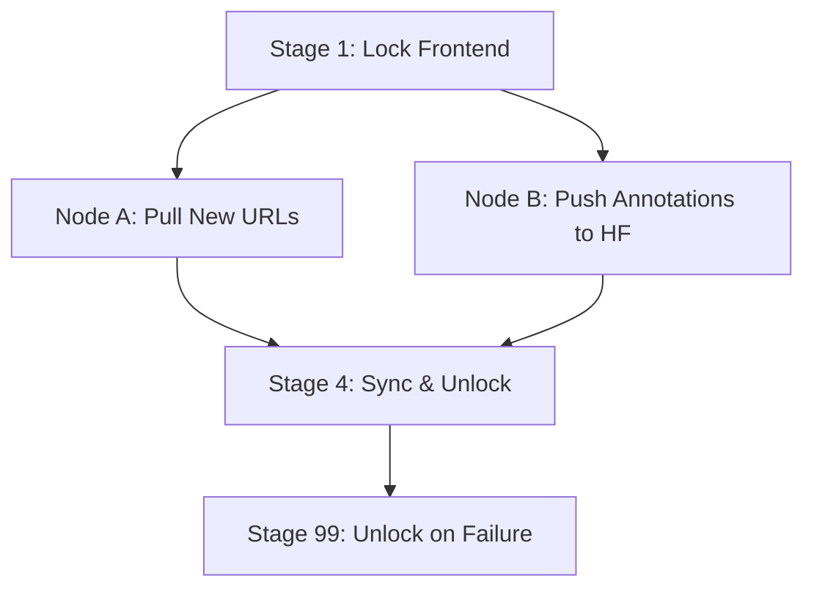

# SolarHub — Nightly Pipeline

> Support Aurora: [GitHub Sponsors](https://github.com/sponsors/soumyadipkarforma) · [Buy Me a Coffee](https://buymeacoffee.com/soumyadipkarforma)

## Schedule

The nightly pipeline runs every day at **00:30 UTC** via a GitHub Actions scheduled trigger.

## Pipeline Lifecycle

The entire pipeline is orchestrated in a single workflow file, `.github/workflows/pipeline.yml`, divided into four primary stages to ensure data integrity and synchronization.

## Stage Details

### Stage 1: Lock Frontend
- **Action**: Renames the `data/` directory to `data_processing/`.
- **Purpose**: Prevents the frontend from reading inconsistent or partially updated task files while the crawler is active.
- **Outcome**: A "locked" repository state where public task data is temporarily unavailable.

### Node A: Pull New URLs
- **Script**: `scripts/pull_new_urls.py`
- **Action**: Crawls the JSOC/HMI imagery database for the previous day's solar captures.
- **Outcome**: New JSON task files are generated in `data_processing/`, each containing unique IDs and image URLs.

### Node B: Push Annotations to HF
- **Script**: `scripts/merge_annotations_to_hf.py`
- **Action**: Synchronizes pending user annotations from the `annotations/` directory with the `SpaceGen/solarhub-*` datasets on HuggingFace.
- **Outcome**: Permanent record of community-labeled data for ML training.

### Stage 4: Sync & Unlock
- **Action**: Merges newly pulled URLs into the `annotations/` folder as blank templates and renames `data_processing/` back to `data/`.
- **Purpose**: Finalizes the daily update and makes new tasks available for labeling.

### Stage 99: Unlock on Failure
- **Trigger**: Runs only if any of the preceding stages fail.
- **Action**: Attempts to recover the repository to an "unlocked" state (renaming `data_processing/` to `data/`) to ensure the system doesn't remain stuck in maintenance mode.

## Parallel Execution
To maximize efficiency, **Node A** (Data Crawling) and **Node B** (HuggingFace Synchronization) run in parallel once the frontend is locked. The final sync only occurs once both nodes complete successfully.
